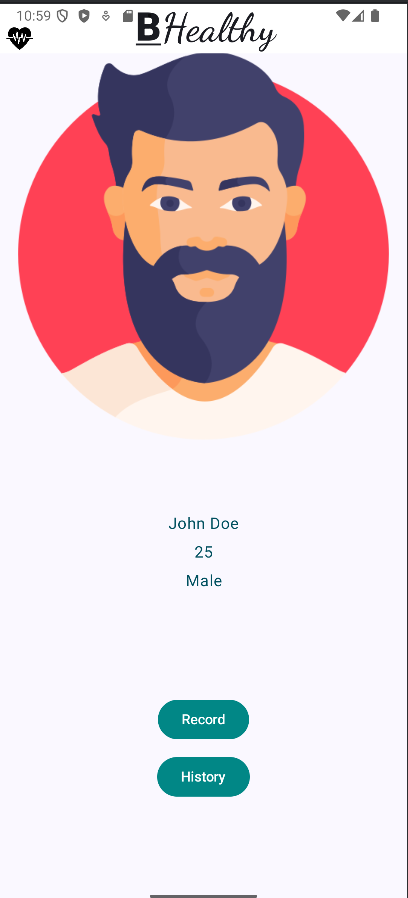
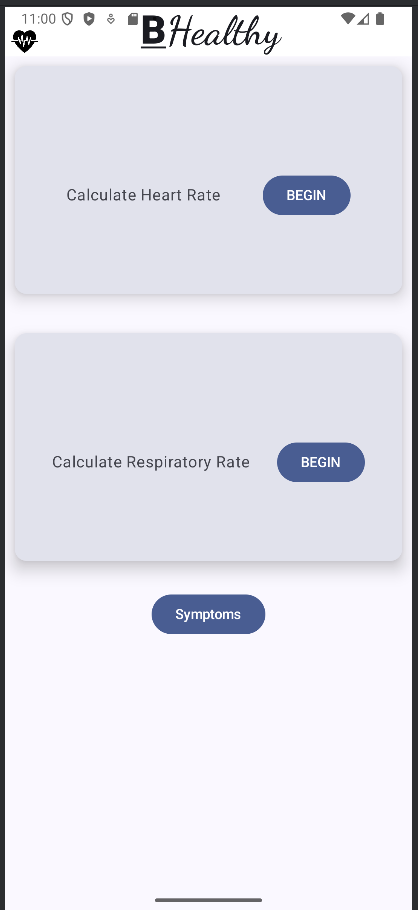
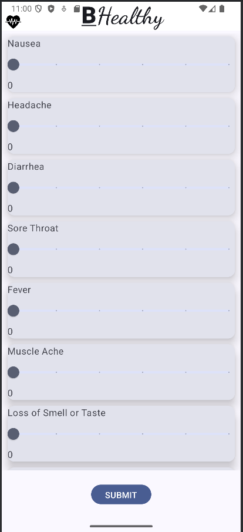

# BHealthy: Health Monitoring System

## Overview

This project is inspired by the BHealthy and Health-Dev papers. It aims to monitor heart rate and respiratory rate using a smartphone. The heart rate is calculated by capturing a video of the user's finger placed on the camera. The video is processed to analyze the pixel changes, which are used to calculate the RBC values every frame, allowing us to approximate the heart rate.

Similarly, the respiratory rate is approximated by capturing the X, Y, Z orientation of the phone when it is placed on a user's chest while they are lying down. As the user breathes, the phone's orientation changes, which is then used to estimate the respiratory rate.

## Demo Video

Check out our demo video [here](https://youtu.be/-1xG1UfvwBI).

## Features

- **Heart Rate Monitoring**: Uses the smartphone camera to capture a video of the user's finger and processes the video to calculate the heart rate.
- **Respiratory Rate Monitoring**: Uses the phone's orientation sensors to capture the X, Y, Z orientation changes as the user breathes, and estimates the respiratory rate.
- **Records Data**: Saves the heart rate and respiratory rate data for future reference and allows users to store any other symptoms they might be facing.

## Implementation Details

- **Technologies Used**:
  - Android Studio
  - Kotlin
  - Jetpack Compose

- **Heart Rate Calculation**:
   - User places their finger on the camera.
   - A video is captured and processed.
   - Pixel changes in the video are analyzed to calculate RBC values.
   - Heart rate is approximated from the RBC values.

- **Respiratory Rate Calculation**:
   - Phone is placed on the user's chest while they are lying down.
   - X, Y, Z orientation data is captured.
   - Orientation changes are analyzed to estimate the respiratory rate.

## Emulator Usage

Since this project was developed using an emulator, video and X, Y, Z orientation data were fed through files instead of live capture. This approach allowed for testing and development without the need for physical hardware.

## References

- BHealthy Paper
- Health-Dev Paper

## License

This project is licensed under the MIT License. See the [LICENSE](LICENSE) file for more details.